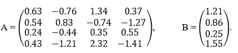
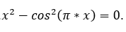
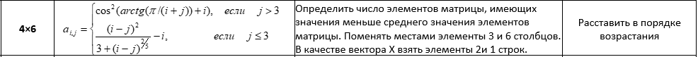
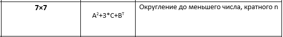
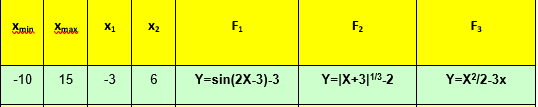

# Matlab
Very simple intro to Matlab
## Task 1 
Решить систему линейных уравнений используя:
* матричную форму записи системы
* метод Крамера 
* Reduced Row Echelon Form

  

## Task 2
Найти приближенно корень уравнения на произвольном интервале используя:
* График функции
* FZERO

  

## Task 3.1
* Сформировать матрицу A(n×m);
* Обработать матрицу А по заданному правилу;
* Преобразовать матрицу А  по заданному правилу;
* Из матрицы  А получить компоненты вектора  X по заданному правилу;
* Отсортировать вектор по заданному правилу.

  

## Task 3.2
* Задать матрицы А, В, С:
  - элементы матрицы A - произвольные числа;
  - элементы матриц B,C - случайные числа;

* Произвести операции над матрицами в соответствии с заданием 

  

## Task 4
Создать таблицу и  график значений кусочной функции на интервале от x_min до x_max с шагом 0.25

  

